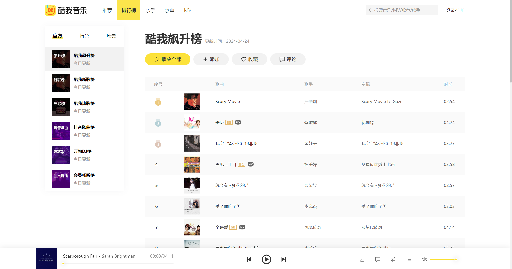
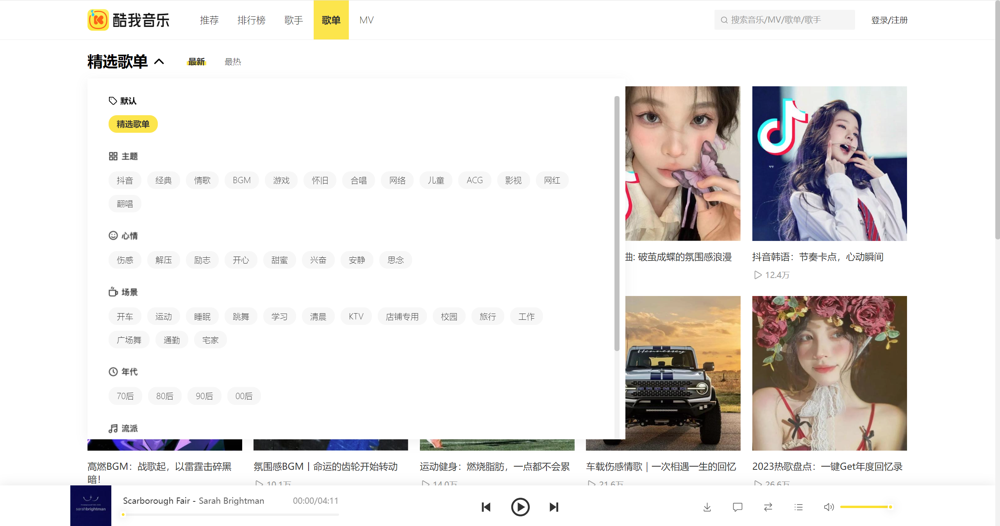
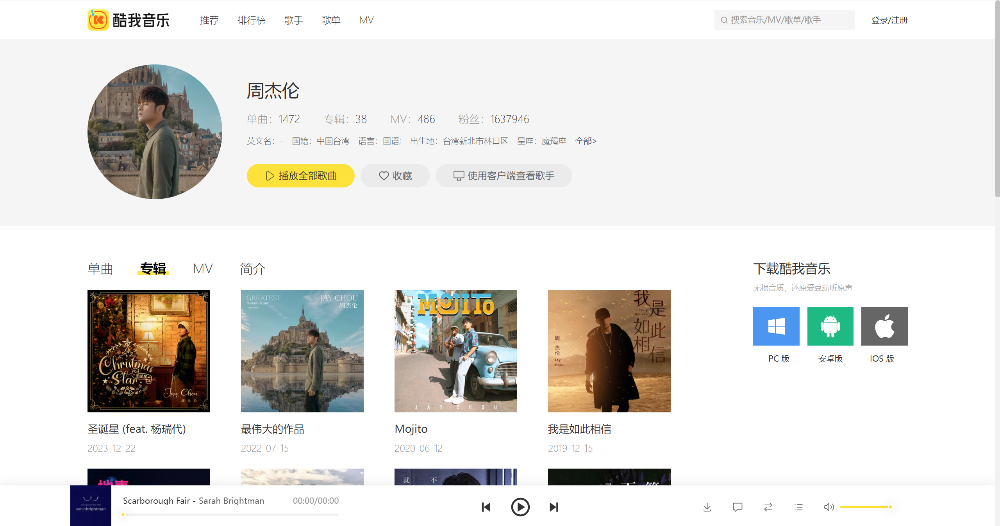
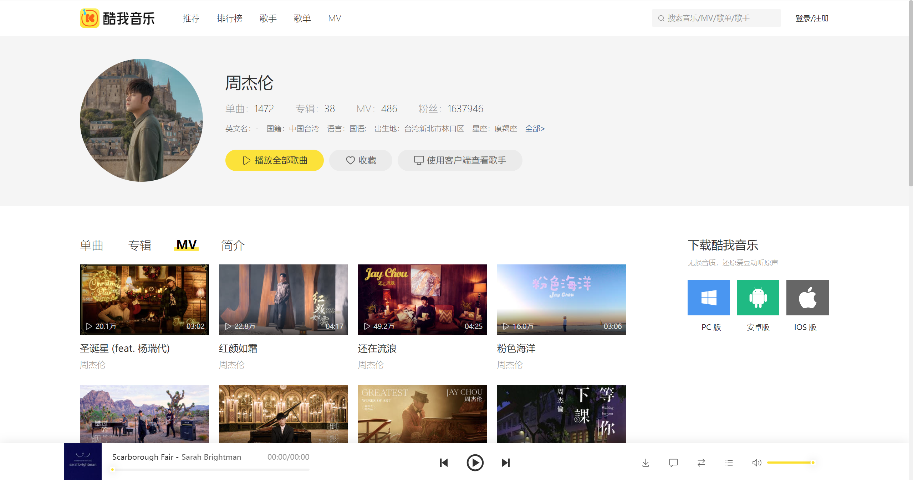
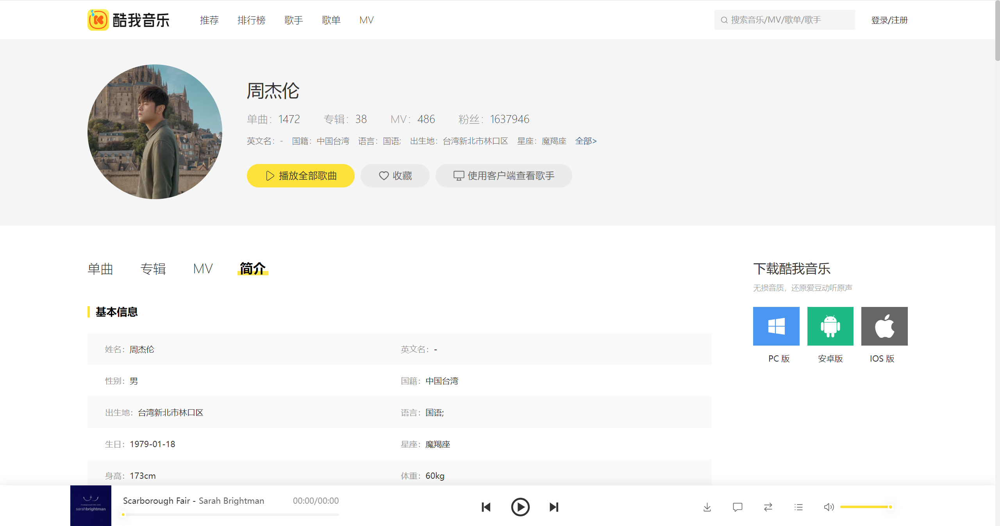
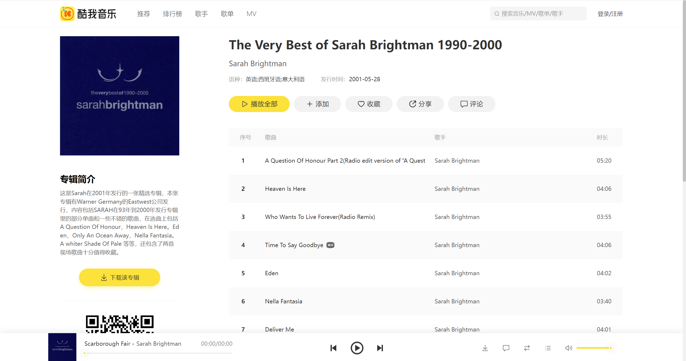
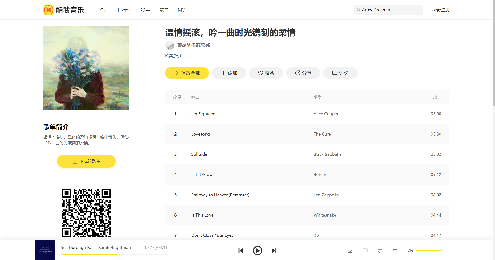
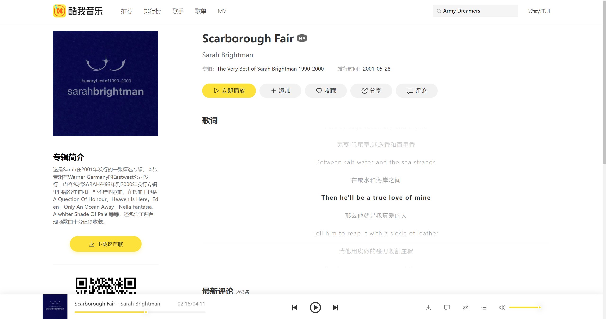
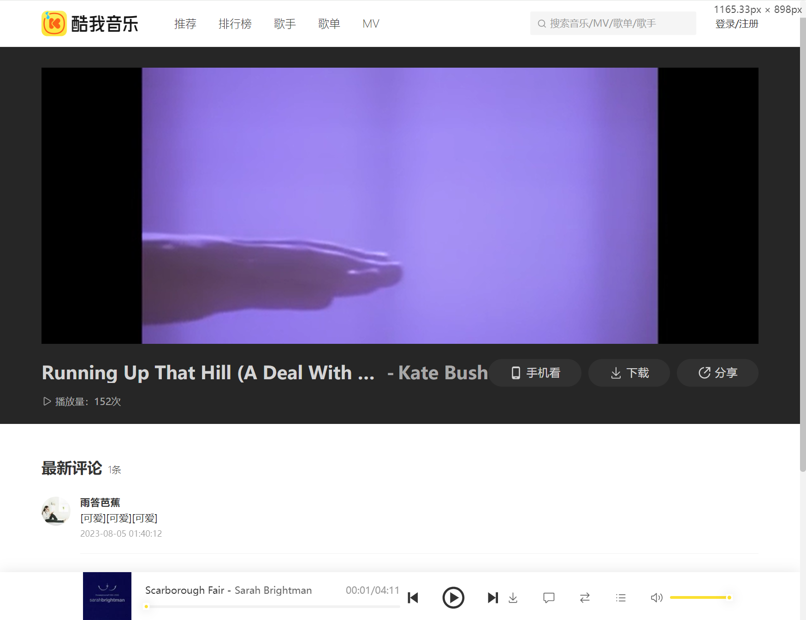
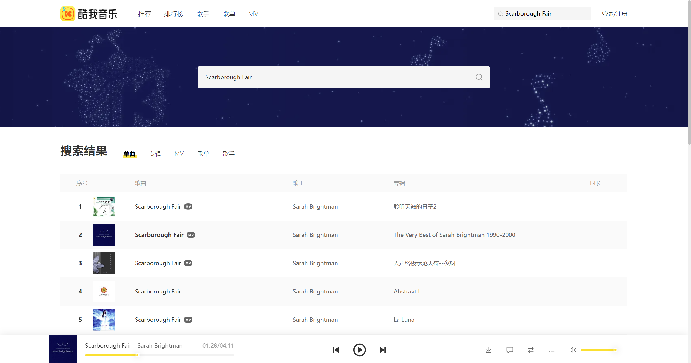

<h1 align="center">
  <a href="https://github.com/ThisIsLoui/mock-kuwo">
    
  </a>
  <br/>
  React 高仿酷我音乐 PC 端
</h1>

<div align="center">
  已实现官网全部页面，高度复原官网样式，数据来源于酷我音乐接口
  <br />
  ✨感兴趣的话，右上角点个免费的 star 支持一下呗✨
  <br />
  <br />
  <a href="https://github.com/dec0dOS/amazing-github-template/issues/new?assignees=&labels=bug&template=01_BUG_REPORT.md&title=bug%3A+">👉👉点我查看演示网站👈👈</a>
</div>

<div align="center">
<br />

[](LICENSE)
[](https://github.com/ThisIsLoui)
[](https://github.com/ThisIsLoui)

</div>

# 🎉 介绍


【React 高仿酷我音乐 PC 端】是一个开源的 react 项目，已经实现了酷我音乐 PC 端网站的全部页面及大部分功能，项目的所有数据均同步获取自酷我音乐官网接口，支持播放歌曲和 MV（不是破解，只能播放免费的），具有完整的歌曲播放逻辑，支持滚动歌词、上一首、下一首、单曲循环、列表循环、顺序播放、音量调节等，还可以查看排行榜、搜索歌曲/专辑/歌单/MV/歌手、查看相应的详情、获取相应的评论等。

本项目采用了如下技术栈：

- 基础框架：React
- 打包工具：Vite
- 样式：CSS Modules + SCSS + classnames 库
- 路由：React Router
- 状态管理：Redux (with Toolkit) + Redux Persist
- 网络请求：RTK Query + Axios
- 前端规范化：Eslint + Prettier + Stylelint + husky + lint-staged + commitlint
- 其他用到的一些库：swiper、react-icons、react-paginate、react-use-audio-player、video.js、ahooks 等

# ⚡ 快速开始

将项目克隆下来

```bash
git clone https://github.com/ThisIsLoui/mock-kuwo.git
```

安装依赖

```bash
npm i
```

打包

```bash
npm run build
```

> 注意，本项目引入了 commitlint 用于规范 `git commit` 时的提交信息。
> 
> 二次开发时请先全局安装 commitizen 
> 
> ```bash
> npm install -g commitizen
> ```
> 
> 接着使用 `cz` 替代 `git commit` 进行提交，项目中已经安装好了 cz-git 适配器，会自动使用它作为 commit 消息规范

# 🌐 接口说明

本项目接口由收集、整理自酷我音乐官网的公开接口，具体使用了哪些接口可以 [查看接口文档](https://mock-kuwo.apifox.cn/)。

另外可以参考 [这篇文章](https://blog.csdn.net/u012981972/article/details/131717687)，了解更多相关信息。

# 💫 路由列表

**`/`：首页推荐**


**`/rankList`：排行榜**



**`/singerList`：歌手列表**


**`/playList`：歌单列表**



**`/mvList`：MV列表**


**`/singer/:id`：歌手详情_单曲**


**`/singer/:id/album`：歌手详情_专辑**



**`/singer/:id/mv`：歌手详情_MV**



**`/singer/:id/info`：歌手详情_简介**



**`/album/:id`：专辑详情**



**`/play/:id`：歌单详情**



**`/song/:id`：歌曲详情**



**`/mvplay/:id`：MV详情**



**`/search?key=xxx&type=xx`：搜索**



路由|页面内容
-------------|-------------
/|首页推荐
/rankList|排行榜
/singerList|歌手列表
/playList|歌单列表
/mvList|MV列表
/singer/:id/|歌手详情_单曲
/singer/:id/album|歌手详情_专辑
/singer/:id/mv|歌手详情_MV
/singer/:id/info|歌手详情_简介
/album/:id|专辑详情
/play/:id|歌单详情
/song/:id|歌曲详情
/mvplay/:id|MV详情
/search?key=xxx&type=xx|搜索

# 📖 开源协议

本项目采用 GPL v3 作为开源协议，查看 [LICENSE](/LICENSE) 以了解更多信息

# 📢 免责声明

本项目及演示网站所有用到的图片、接口均由网络公开内容收集整理而来，仅用于学习和研究目的，不得用于商业用途。任何个人或组织不得将其用于违法用途，否则后果自负。